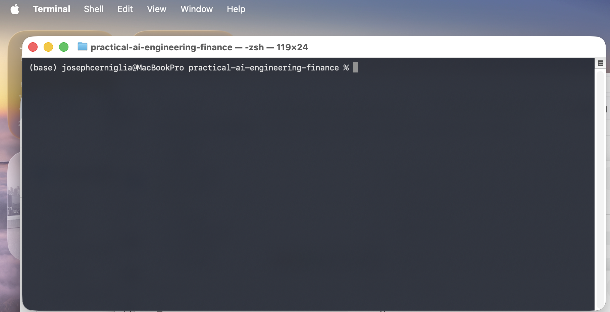
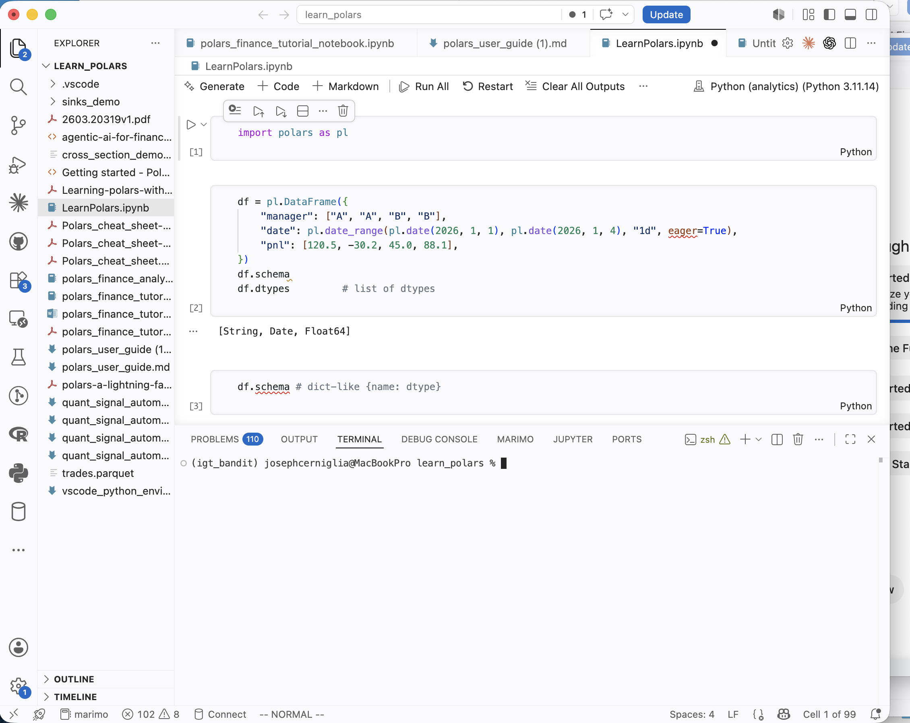
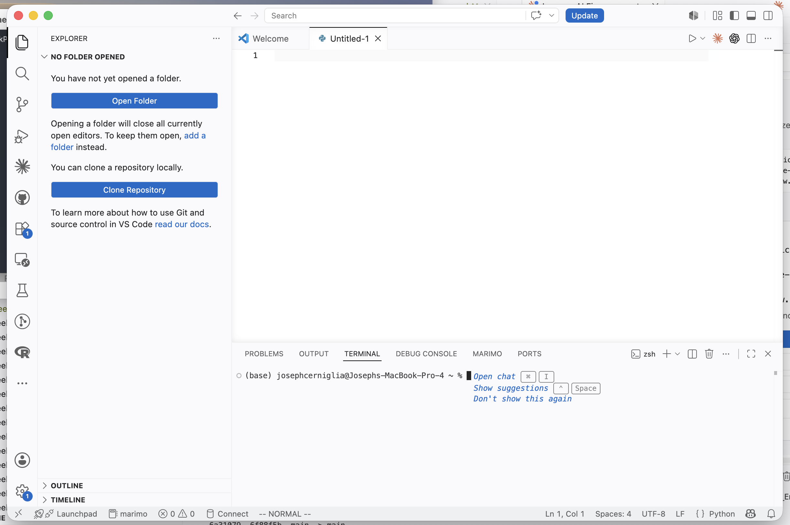

# Week 1: Becoming an AI Engineer

**Course:** Practical AI Engineering for Finance  
**Audience:** Senior undergraduate students  
**Schedule:** 1 hour per day, 4 days per week  
**Week Theme:** AI fundamentals, macOS setup, Visual Studio Code, Python, Git, and GitHub

---

## Week Overview

Welcome to *Practical AI Engineering for Finance*.

This course is designed to help you move beyond introductory AI certificates and begin building real software. You will learn how to write Python programs, work with APIs, use large language models, build retrieval systems, evaluate model output, test your code, and deploy an application.

The course is project-based. Each week introduces a new technical skill and connects it to a semester-long capstone:

> **AI-Powered Equity Research Assistant**

By the end of the semester, your application will retrieve financial information, search company documents, answer questions using evidence, evaluate its own output, and expose its features through a web API.

Week 1 focuses on the tools and concepts you need before you begin building larger applications.

---

## Contents

- [Learning Objectives](#learning-objectives)
- [Weekly Schedule](#weekly-schedule)
- [Day 1: Introduction to AI Engineering](#day-1-introduction-to-ai-engineering)
- [Day 2: Setting Up a Mac for Development](#day-2-setting-up-a-mac-for-development)
- [Day 3: Visual Studio Code and Your First Python Program](#day-3-visual-studio-code-and-your-first-python-program)
- [Day 4: Git and GitHub](#day-4-git-and-github)
- [Week 1 Coding Lab](#week-1-coding-lab)
- [Practice Exercises](#practice-exercises)
- [Common Mistakes](#common-mistakes)
- [Interview Preparation](#interview-preparation)
- [Week 1 Quiz](#week-1-quiz)
- [Week 1 Project Submission Checklist](#week-1-project-submission-checklist)
- [Week 1 Reflection](#week-1-reflection)
- [Key Terms](#key-terms)
- [Week Summary](#week-summary)
- [Suggested Reading](#suggested-reading)
- [Next Week](#next-week)

---

# Learning Objectives

By the end of Week 1, you should be able to:

- Explain the differences among Artificial Intelligence, Machine Learning, Deep Learning, Generative AI, and Large Language Models.
- Describe what an AI engineer does.
- Identify practical uses of AI in finance.
- Use the macOS Terminal to navigate files and folders.
- Install Python, Git, and Visual Studio Code on a Mac.
- Create and activate a Python virtual environment.
- Open a project folder in Visual Studio Code.
- Write and run a basic Python program.
- Create a Git repository.
- Commit changes and push them to GitHub.
- Explain why API keys and private data should not be uploaded to a public repository.

---

# Weekly Schedule

| Day | Topic | Main Deliverable |
|---|---|---|
| Day 1 | Introduction to AI Engineering | AI-in-finance reflection |
| Day 2 | macOS, Terminal, Python, and virtual environments | Working development environment |
| Day 3 | Visual Studio Code and first Python program | Student profile program |
| Day 4 | Git and GitHub | Published GitHub repository |

Each class is designed for approximately one hour.

A recommended session structure is:

- **10 minutes:** Review and setup
- **15 minutes:** New concept
- **25 minutes:** Guided practice
- **5 minutes:** Test the result
- **5 minutes:** Document and commit the work

---

# Day 1: Introduction to AI Engineering

## 1.1 What Is Artificial Intelligence?

Artificial Intelligence, usually abbreviated as **AI**, is the broad field of building computer systems that perform tasks commonly associated with human intelligence.

Examples include:

- understanding language;
- recognizing images;
- making predictions;
- recommending products;
- planning routes;
- answering questions;
- writing computer code.

AI is not one single technology. It is a collection of methods, models, and software systems.

A useful way to organize the field is:

```text
Artificial Intelligence
|
+-- Rule-Based Systems
|
+-- Machine Learning
    |
    +-- Supervised Learning
    +-- Unsupervised Learning
    +-- Reinforcement Learning
    |
    +-- Deep Learning
        |
        +-- Computer Vision Models
        +-- Speech Models
        +-- Large Language Models
```

## 1.2 Machine Learning

**Machine Learning** is a branch of AI in which a computer learns patterns from data.

In traditional programming:

```text
Data + Rules -> Answer
```

In machine learning:

```text
Data + Correct Answers -> Learned Model
```

For example, a bank could train a machine-learning model to detect suspicious transactions using historical examples of normal and fraudulent activity.

Common applications in finance include:

- credit scoring;
- fraud detection;
- customer segmentation;
- risk forecasting;
- default prediction;
- return prediction;
- portfolio construction.

## 1.3 Deep Learning

**Deep Learning** is a type of machine learning that uses neural networks with many layers.

Deep-learning systems are especially effective when working with large and complex datasets such as:

- images;
- speech;
- video;
- text;
- large collections of financial documents.

Many modern generative AI systems are built using deep learning.

## 1.4 Generative AI

**Generative AI** creates new content.

It can generate:

- text;
- images;
- code;
- audio;
- video;
- structured data.

A traditional classification model might decide whether an earnings report is positive or negative. A generative model might produce a written summary of the earnings report.

## 1.5 Large Language Models

A **Large Language Model**, or **LLM**, is a generative AI model trained on a very large collection of text.

An LLM predicts likely sequences of tokens. A token may represent a word, part of a word, punctuation, or another unit of text.

LLMs can perform tasks such as:

- summarizing reports;
- drafting emails;
- explaining concepts;
- generating code;
- extracting structured information;
- comparing documents;
- answering questions.

LLMs are powerful, but they are not automatically reliable. They may:

- provide incorrect information;
- invent facts;
- omit important details;
- misinterpret a question;
- produce confident answers without evidence.

For that reason, AI engineering includes evaluation, testing, and human review.

## 1.6 What Is AI Engineering?

AI engineering is the practice of building useful and reliable software systems that use AI models.

An AI engineer often works across several areas:

1. **Software development** — writing maintainable Python code.
2. **Data ingestion** — retrieving information from files, databases, and APIs.
3. **Prompt design** — giving clear instructions to an LLM.
4. **Retrieval** — finding relevant documents or passages.
5. **Evaluation** — measuring whether the system is accurate and useful.
6. **Testing** — confirming that software components work as expected.
7. **Deployment** — making an application available to users.

An AI engineer does more than send questions to a chatbot. The engineer builds the complete system around the model.

## 1.7 AI Applications in Finance

| Area | Example |
|---|---|
| Equity research | Summarize earnings calls and filings |
| Investment management | Screen companies and track investment theses |
| Risk management | Detect changes in exposures or market conditions |
| Banking | Detect fraud and automate customer support |
| Wealth management | Produce personalized financial explanations |
| Operations | Extract information from documents |
| Compliance | Review communications and identify potential issues |

### Human Oversight

AI should support judgment rather than replace it blindly.

A financial analyst still needs to:

- verify facts;
- understand the company and industry;
- evaluate uncertainty;
- recognize missing information;
- make decisions;
- take responsibility for conclusions.

## 1.8 The Course Capstone

The semester project is an **AI-Powered Equity Research Assistant**.

The finished application will be designed to:

- retrieve public company information;
- ingest documents;
- divide documents into searchable sections;
- store document representations in a vector database;
- retrieve evidence related to a question;
- generate an answer based on that evidence;
- identify the source of each answer;
- evaluate answer quality;
- expose features through an API;
- run locally or through a deployed application.

Each week adds one part of this system.

## Day 1 Activity

Write 250–300 words answering:

> Identify one repetitive task performed by an investment analyst, banker, or financial advisor. Explain how AI could improve the task and describe one risk that would require human oversight.

Save the response as:

```text
week1_ai_reflection.md
```

---

# Day 2: Setting Up a Mac for Development

Today's sections build on each other in order — each tool depends on the one before it:

```text
Homebrew   -->  Python & Git   -->  VS Code            -->  code .        -->  Virtual environment
(package        (installed via      (editor, debugger,      (open the         (isolated project
 manager)        Homebrew)           Source Control)         folder)           dependencies)
```

## 2.1 The Main Tools

| Tool | Purpose | How It Fits Together |
|---|---|---|
| Terminal | Run commands and manage files | Where you type the commands that launch Python, Git, and Homebrew |
| Python | Execute the programs you write | Installed once via Homebrew; run from Terminal or from inside VS Code |
| VS Code | Write, run, and debug code | Bundles an editor, a Terminal, and Git's Source Control panel into one window |
| Git | Record changes to code | Runs locally on your Mac; saves a snapshot ("commit") each time you save progress |
| GitHub | Store and share Git repositories online | The remote home for your repository; `git push` and `git pull` sync it with Git on your Mac |

These five tools form one pipeline: you write code in **VS Code**, which runs it through **Python** and tracks it with **Git**, both reachable from VS Code's built-in **Terminal**. **Git** then syncs that history to **GitHub**.

```text
VS Code
|
+-- built-in Terminal
|     |
|     +-- runs -------> Python   (executes your .py files)
|     +-- runs -------> Git      (records local commits)
|
+-- Source Control panel
      |
      +-- also drives -> Git
                            |
                            +-- push / pull --> GitHub (remote copy)
```

## 2.2 Finder and Terminal

Finder is the graphical file browser on macOS.

Terminal is a text-based way to interact with the same files and folders.

To open Terminal:

1. Press `Command + Space`.
2. Type `Terminal`.
3. Press Return.



*Screenshot to add: an open Terminal window showing your username, computer name, and the `%` prompt. Replace `docs/weeks/images/week-01/terminal-window.png` with your own screenshot (keep the same filename, or update the path above).*

## 2.3 Basic Terminal Commands

```bash
pwd
ls
ls -la
mkdir practical-ai-course
cd practical-ai-course
cd ..
touch notes.md
rm notes.md
```

| Command | What It Does |
|---|---|
| `pwd` | Prints the full path of the current folder ("print working directory") |
| `ls` | Lists the files and folders in the current folder |
| `ls -la` | Lists files and folders, including hidden ones (`-a`), with details like size and permissions (`-l`) |
| `mkdir practical-ai-course` | Creates a new folder named `practical-ai-course` |
| `cd practical-ai-course` | Moves into the `practical-ai-course` folder ("change directory") |
| `cd ..` | Moves up one folder, to the parent of the current folder |
| `touch notes.md` | Creates an empty file named `notes.md` (or updates its timestamp if it already exists) |
| `rm notes.md` | Deletes `notes.md` |

Be careful with `rm`; it usually removes a file immediately.

## 2.4 Recommended Course Folder

```bash
cd ~
mkdir practical-ai-engineering-finance
cd practical-ai-engineering-finance
pwd
```

## 2.5 Installing Homebrew

**Homebrew** is macOS's most widely used package manager. Instead of hunting down individual installers for command-line tools, you tell Homebrew what you want (`brew install python`, `brew install git`) and it downloads, installs, and keeps them up to date for you.

Use the [official Homebrew installation instructions](https://brew.sh). Then verify:

```bash
brew --version
```

If `brew` is not found afterward, Homebrew's install path likely isn't on your `PATH` yet — on Apple Silicon Macs it installs to `/opt/homebrew`, on Intel Macs to `/usr/local`. The installer prints the exact command to add it; run that, then restart Terminal.

## 2.6 Installing Python

```bash
brew install python
python3 --version
python3 -m pip --version
```

Use Python 3.11 or later.

## 2.7 Installing Git

**Git** is version-control software: it saves a snapshot (a "commit") of your project every time you choose to save progress, so you can see what changed, compare versions, and undo mistakes. You'll install it now and use it starting Day 4; §4.1 covers version control in more depth.

```bash
brew install git
git --version
git config --global user.name "Your Name"
git config --global user.email "your-email@example.com"
```

## 2.8 Installing Visual Studio Code

1. Go to the [official VS Code download page](https://code.visualstudio.com/download) and download the Mac build. Choose **Universal** unless you specifically know you want an Apple Silicon– or Intel-only build — Universal runs on either.
2. Safari usually unzips the download automatically. If it doesn't, double-click the `.zip` file in your Downloads folder; you'll get `Visual Studio Code.app`.
3. Drag `Visual Studio Code.app` into your `Applications` folder.
4. Launch it from Applications (or Spotlight: `Command + Space`, type `Visual Studio Code`). On first launch, macOS may warn that the app was downloaded from the internet — click **Open** to confirm.

For a fuller walkthrough with more screenshots than fit on this page, see the [official VS Code macOS setup guide](https://code.visualstudio.com/docs/setup/mac).



*Screenshot to add: VS Code just after opening, with the Explorer sidebar and Welcome tab visible. Replace `docs/weeks/images/week-01/vscode-window.png` with your own screenshot.*

**Install extensions:**

1. Open the Extensions view: `Command + Shift + X`.
2. Search for each name below and click **Install**.

- Python
- Pylance
- Jupyter
- Ruff
- GitHub Pull Requests
- Markdown All in One

## 2.9 Opening VS Code from Terminal

```bash
code .
```

`code` is a small command-line shim that VS Code installs. It tells the app "open a folder as a workspace." The `.` means *the current folder* — so `code .` opens whatever folder Terminal is sitting in right now, with its file tree shown in VS Code's Explorer panel. Run it from inside your course folder (§2.4), not your home directory.

If `code` is unavailable:

1. Open VS Code.
2. Press `Command + Shift + P`.
3. Select `Shell Command: Install 'code' command in PATH`.
4. Restart Terminal.

Once the folder is open, you don't need to switch back to the Terminal app — VS Code has its own **integrated terminal**, the same shell docked inside the editor window. Open it with `` Control + ` `` or **View → Terminal**. It runs the same commands as §2.2's Terminal, just without leaving VS Code.



*Screenshot to add: VS Code with the integrated terminal panel open at the bottom. Replace `docs/weeks/images/week-01/vscode-integrated-terminal.png` with your own screenshot.*

## 2.10 Python Virtual Environments

A **virtual environment** is an isolated, project-specific copy of Python and its installed packages. Without one, every project on your Mac shares the same global set of packages — if one project needs an old version of a library and another needs the newest version, installing one breaks the other.

A virtual environment fixes this by creating a private folder (conventionally named `.venv`) inside your project that holds its own Python interpreter and its own installed packages, completely separate from your system Python and from every other project's `.venv`.

```text
System Python
|
+-- Project A/.venv  --> pandas 1.5, requests 2.28   (isolated)
+-- Project B/.venv  --> pandas 2.2, requests 2.31   (isolated)
```

Each project's dependencies stay independent, so upgrading a package for one class assignment can't silently break another.

```bash
python3 -m venv .venv
source .venv/bin/activate
python -m pip install --upgrade pip
deactivate
```

Reactivate later with:

```bash
source .venv/bin/activate
```

### Activating the Virtual Environment in VS Code

VS Code needs to be told which Python interpreter to use:

1. Press `Command + Shift + P` to open the Command Palette.
2. Run `Python: Select Interpreter`.
3. Choose the interpreter inside `.venv` (its path ends in `.venv/bin/python`).

After that, every **new** integrated terminal VS Code opens for this project auto-activates `.venv` for you — its prompt will start with `(.venv)`, so you don't need to run `source .venv/bin/activate` yourself inside VS Code. The active interpreter is also shown in the blue status bar at the bottom of the window; click it any time to switch.

## 2.11 Common Setup Problems

### `command not found`

Possible causes:

- the software is not installed;
- Terminal has not been restarted;
- the installation directory is not in `PATH`.

### Wrong Python interpreter

```bash
which python
which python3
```

### VS Code uses the wrong interpreter

1. Press `Command + Shift + P`.
2. Select `Python: Select Interpreter`.
3. Choose the interpreter inside `.venv`.

## Day 2 Activity

Create `setup_check.md` and record the output of:

```bash
python3 --version
git --version
pwd
```

Do not include passwords, tokens, or private information.

---

# Day 3: Visual Studio Code and Your First Python Program

## 3.1 What Is Visual Studio Code?

VS Code combines:

- file navigation;
- code editing;
- syntax highlighting;
- autocomplete;
- debugging;
- source control;
- Terminal access;
- extensions.

## 3.2 Main Areas of VS Code

- **Explorer:** files and folders.
- **Search:** search the repository.
- **Source Control:** review Git changes.
- **Integrated Terminal:** run commands.
- **Command Palette:** access commands.
- **Problems Panel:** display errors and warnings.
- **Debugger:** pause and inspect programs.

Useful shortcuts:

| Action | Shortcut |
|---|---|
| Command Palette | `Command + Shift + P` |
| Search repository | `Command + Shift + F` |
| Open file | `Command + P` |
| Save | `Command + S` |
| Start debugging | `F5` |

## 3.3 First Python File

Create `hello.py`:

```python
print("Hello, AI Engineering!")
```

Run:

```bash
python hello.py
```

## 3.4 Variables

```python
name = "Jordan Lee"
major = "Finance"
graduation_year = 2027

print(name)
print(major)
print(graduation_year)
```

## 3.5 Formatted Strings

```python
name = "Jordan Lee"
major = "Finance"

print(f"{name} is studying {major}.")
```

## 3.6 User Input

```python
name = input("What is your name? ")
print(f"Welcome, {name}!")
```

Convert numeric input:

```python
graduation_year = int(input("What year will you graduate? "))
```

`int()` raises a `ValueError` if the text isn't a whole number (try typing "soon" instead of a year). Handle it with `try`/`except` so the program doesn't crash:

```python
try:
    graduation_year = int(input("What year will you graduate? "))
except ValueError:
    print("Please enter a number, such as 2027.")
```

## 3.7 Functions

```python
def create_introduction(name: str, major: str, graduation_year: int) -> str:
    return (
        f"My name is {name}. "
        f"I study {major} and expect to graduate in {graduation_year}."
    )
```

## 3.8 Complete Student Profile Program

Create `student_profile.py`:

```python
def create_profile(
    name: str,
    major: str,
    graduation_year: int,
    career_interest: str,
) -> str:
    """Create a formatted student profile."""
    return (
        "\nStudent Profile\n"
        "---------------\n"
        f"Name: {name}\n"
        f"Major: {major}\n"
        f"Graduation year: {graduation_year}\n"
        f"Career interest: {career_interest}\n"
    )


def main() -> None:
    """Run the command-line application."""
    name = input("Name: ").strip()
    major = input("Major: ").strip()
    graduation_year = int(input("Graduation year: "))
    career_interest = input("Career interest: ").strip()

    profile = create_profile(
        name=name,
        major=major,
        graduation_year=graduation_year,
        career_interest=career_interest,
    )

    print(profile)


if __name__ == "__main__":
    main()
```

## 3.9 Save Output to a File

```python
from pathlib import Path


def save_profile(profile: str, filename: str = "student_profile.txt") -> None:
    """Save the profile to a text file."""
    Path(filename).write_text(profile, encoding="utf-8")
```

Call it after printing:

```python
save_profile(profile)
print("Profile saved to student_profile.txt")
```

## 3.10 Debugging in VS Code

1. Open `student_profile.py`.
2. Click beside a line number to create a breakpoint.
3. Press `F5`.
4. Enter the requested values.
5. Inspect the Variables panel.
6. Use Step Over to move through the program.

## 3.11 Using Jupyter Notebooks in VS Code

A **notebook** (a `.ipynb` file) is a sequence of cells — some hold code, some hold formatted text — that you run one at a time, with each cell's output displayed right below it. That makes notebooks well suited to exploring data step by step, which is why you'll use them starting Week 2. A `.py` script, by contrast, only shows output when the whole file runs.

You already installed the **Jupyter** extension in §2.8, so VS Code opens `.ipynb` files with a notebook interface automatically — no extra setup.

To run one:

1. Open `notebooks/week01_intro_notebook.ipynb` (Explorer, or `code notebooks/week01_intro_notebook.ipynb` from Terminal).
2. Click **Select Kernel** in the top-right corner and choose the interpreter inside your project's `.venv` — the same one from §2.10.
3. Click the ▷ next to a cell, or press `Shift + Enter`, to run it and move to the next cell.
4. If VS Code prompts that `ipykernel` needs to be installed, click **Install** — it installs into your active `.venv`, not system-wide.

The sample notebook loads `data/sample/prices.csv` and reuses the `simple_return()` function from `src/ai_finance_course/returns.py` — the same helper introduced in this week's code, not a new formula.

## Day 3 Activity

Add these fields:

- one technical skill;
- one company or industry of interest.

---

# Day 4: Git and GitHub

## 4.1 What Is Version Control?

Version control records changes to files over time.

Git replaces filenames such as:

```text
project_final.py
project_final2.py
project_really_final.py
```

with a structured project history.

## 4.2 What Is Git?

Git is a **distributed version control system** — software that tracks every change to your files over time, running entirely on your own computer. No internet connection is required to commit.

A few core ideas:

- A **repository** ("repo") is a project folder Git is tracking, marked by a hidden `.git` folder inside it.
- A **commit** is a saved snapshot of your files at a point in time, with a message describing what changed.
- A **branch** is a named line of development — `main` is the default branch this course uses.

Because Git is *distributed*, cloning a repository copies its entire history, not just the latest version — every collaborator has a full backup of the project's history, not only whoever hosts it.

## 4.3 What Is GitHub?

GitHub is a website that hosts Git repositories online and adds features Git itself doesn't have:

- a web interface to browse code, commits, and history;
- **pull requests**, for proposing and reviewing changes before merging them;
- **Issues**, for tracking bugs and tasks;
- **GitHub Actions**, for running automated tests and deployments (this course's own documentation site deploys itself this way).

GitHub is one option among several — GitLab and Bitbucket are others. Git the tool doesn't require GitHub the website; this course uses GitHub because it's the most widely used in industry.

## 4.4 Local Repository vs. Remote (`origin`)

This distinction trips up almost every beginner, so it's worth stating plainly:

- Your **local repository** is the `.git` folder on your own Mac. Every `git commit` you run changes only this local copy.
- A **remote** is a copy of the repository hosted somewhere else — usually GitHub. Git calls the remote you first connect or push to `origin` by default. It's just a name; you could rename it, but almost nobody does.

```text
Your Mac                                GitHub
+-------------------+   git push    +-------------------+
|  Local repository  | ------------> |   origin (remote)  |
|   (.git folder)    | <------------ |                     |
+-------------------+   git pull    +-------------------+
```

Nothing you commit locally reaches GitHub until you run `git push`. Nothing someone else pushed to GitHub reaches your Mac until you run `git pull`. See which remotes a repository knows about with:

```bash
git remote -v
```

## 4.5 Common Git Commands

| Command | What It Does |
|---|---|
| `git init` | Turns the current folder into a Git repository |
| `git status` | Shows what's changed, staged, or untracked |
| `git add <file>` | Stages a file's changes to be included in the next commit |
| `git commit -m "message"` | Saves a snapshot of staged changes, with a message |
| `git push` | Sends local commits to the remote (`origin`) |
| `git pull` | Fetches and merges remote changes into your local branch |
| `git clone <url>` | Copies a remote repository to your Mac, including its full history |
| `git log` | Shows the commit history |
| `git diff` | Shows exactly what changed, line by line, before you stage it |
| `git branch` | Lists branches, or creates a new one |
| `git remote -v` | Lists the remotes (like `origin`) a repository knows about |

## 4.6 Initialize a Repository

```bash
git init
git status
```

## 4.7 Create `.gitignore`

```text
.venv/
__pycache__/
.DS_Store
.env
*.pyc
```

Never commit:

- API keys;
- passwords;
- private financial data;
- confidential documents;
- `.env` files.

## 4.8 Stage and Commit

```bash
git status
git add .
git commit -m "Complete Week 1 student profile"
```

## 4.9 Create a GitHub Repository

Name it:

```text
practical-ai-engineering-finance
```

Then connect it:

```bash
git branch -M main
git remote add origin https://github.com/YOUR-USERNAME/practical-ai-engineering-finance.git
git push -u origin main
```

`git remote add origin ...` is the exact moment your local repository (§4.4) gets a remote to push to and pull from.

## 4.10 Daily Git Workflow

```bash
git status
git add .
git commit -m "Describe the completed work"
git push
```

Good commit messages:

```text
Add Week 1 AI reflection
Create student profile program
Add profile file output
Document Mac development setup
```

## 4.11 Basic README

```markdown
# Practical AI Engineering for Finance

This repository contains my work for a project-based course in Python and AI engineering.

## Week 1

During Week 1, I:

- reviewed AI and machine-learning concepts;
- configured Python and VS Code on macOS;
- created a virtual environment;
- built a student profile program;
- learned the basics of Git and GitHub.

## Run the Program

```bash
source .venv/bin/activate
python student_profile.py
```
```

## 4.12 A Few Worked Examples

**Cloning a repository you don't have locally yet:**

```bash
git clone https://github.com/YOUR-USERNAME/practical-ai-engineering-finance.git
cd practical-ai-engineering-finance
```

**You edited a file and want to save the change:**

```bash
git status                              # confirm the file shows as modified
git diff                                # review exactly what changed, line by line
git add student_profile.py
git commit -m "Add career interest field"
git push
```

**Checking what's committed locally but not yet on GitHub:**

```bash
git log origin/main..HEAD --oneline
```

## 4.13 Using Claude or ChatGPT to Understand Git

Git's error messages are notoriously unfriendly to beginners. An AI assistant is genuinely useful here — paste the exact command and error message, and ask what it means before trying random fixes.

Example prompts worth trying:

- *"I ran `git push` and got `! [rejected] main -> main (fetch first)`. What does this mean, and what command fixes it?"*
- *"What's the difference between `git pull` and `git fetch`?"*
- *"I have uncommitted changes in a file I didn't mean to edit. How do I undo just that file, without losing my other changes?"*

One caution: ask the assistant to **explain** the fix, not just hand you a command to paste. Git has several commands (`reset`, `revert`, `checkout`) that can discard work if used carelessly — understanding *why* a command works is what makes it safe to reuse the next time you hit the same error.

## 4.14 Reference Websites

- [git-scm.com](https://git-scm.com/) — official Git documentation, including the free *Pro Git* book
- [docs.github.com](https://docs.github.com/) — official GitHub documentation
- [skills.github.com](https://skills.github.com/) — free, hands-on GitHub tutorials
- [Atlassian Git Tutorials](https://www.atlassian.com/git/tutorials) — clear conceptual explanations with diagrams

## Day 4 Activity

The repository should contain:

```text
practical-ai-engineering-finance/
|
+-- .gitignore
+-- README.md
+-- week1_ai_reflection.md
+-- setup_check.md
+-- hello.py
+-- student_profile.py
+-- student_profile.txt
```

Do not commit `.venv`.

---

# Week 1 Coding Lab

## Student Portfolio Application

The application must collect:

- name;
- major;
- graduation year;
- career interest;
- technical skill;
- company or industry of interest.

It should display:

```text
Student Portfolio
-----------------
Name: Jordan Lee
Major: Finance
Graduation year: 2027
Career interest: Equity research
Technical skill: Python
Industry interest: Semiconductors
```

### Required Features

- at least one function;
- type hints;
- a `main()` function;
- `.strip()` on text inputs;
- output saved to a text file;
- at least one docstring;
- no runtime errors;
- a README;
- a GitHub repository.

---

# Practice Exercises

## Exercise 1: Terminal Navigation

1. Move to the home directory.
2. Create `terminal_practice`.
3. Enter the folder.
4. Create `notes.md`.
5. List the contents.
6. Move to the parent folder.

## Exercise 2: Personal Introduction

Write a Python program that prints your name, major, graduation year, and career goal.

## Exercise 3: User Input

Modify the program so the user enters the information.

## Exercise 4: Functions

Write:

```python
def format_career_goal(name: str, goal: str) -> str:
    ...
```

## Exercise 5: File Output

Save the result to `career_goal.txt`.

## Exercise 6: Git Practice

Make three commits:

1. Add the introduction program.
2. Add user input.
3. Add file output.

---

# Common Mistakes

## Running Python outside the virtual environment

```bash
source .venv/bin/activate
```

## Saving the wrong file type

Use `.py`, not `.py.txt`.

## Running in the wrong folder

```bash
pwd
ls
```

## Committing `.venv`

Add `.venv/` to `.gitignore`.

## Uploading secrets

Never put API keys directly in public code.

---

# Interview Preparation

1. What is the difference between AI and Machine Learning?
2. What is Generative AI?
3. What is an LLM?
4. What does an AI engineer do?
5. Why is Python widely used in AI?
6. What is VS Code?
7. What is Terminal?
8. What is a virtual environment?
9. What is the difference between Git and GitHub?
10. What does `git commit` do?
11. Why is `.gitignore` important?
12. Why should API keys not be stored publicly?

---

# Week 1 Quiz

## Multiple Choice

1. Which statement best describes Machine Learning?

   A. A website for storing code  
   B. A method in which computers learn patterns from data  
   C. A text editor  
   D. A package manager

2. Which tool records the history of code changes?

   A. Python  
   B. Git  
   C. Finder  
   D. Homebrew

3. Which command shows the current directory?

   A. `ls`  
   B. `cd`  
   C. `pwd`  
   D. `git status`

4. What is the purpose of a virtual environment?

   A. Store files on GitHub  
   B. Isolate Python packages for a project  
   C. Create charts  
   D. Encrypt source code

5. Which file tells Git what not to track?

   A. `README.md`  
   B. `.gitignore`  
   C. `requirements.txt`  
   D. `main.py`

## Short Answer

6. Explain the difference between Git and GitHub.

7. Why can an LLM produce an incorrect answer?

8. Name two applications of AI in finance.

9. Why organize code into functions?

10. What is the purpose of a README?

---

# Week 1 Project Submission Checklist

- [ ] The program runs on macOS.
- [ ] `.venv` is not committed.
- [ ] The repository contains a README.
- [ ] The program uses functions.
- [ ] The program uses type hints.
- [ ] The program saves output to a file.
- [ ] Commit messages are descriptive.
- [ ] The repository is pushed to GitHub.
- [ ] No secrets or private data are included.
- [ ] The student can explain the project in two minutes.

---

# Week 1 Reflection

Write 200–300 words answering:

1. What did you build?
2. What part of the setup was most difficult?
3. What error did you encounter?
4. How did you solve it?
5. What skill from this week would be useful in a job?
6. What would you improve?

Save as:

```text
week1_reflection.md
```

---

# Key Terms

| Term | Definition |
|---|---|
| Artificial Intelligence | Systems that perform tasks associated with human intelligence |
| Machine Learning | Systems that learn patterns from data |
| Deep Learning | Machine learning using multi-layer neural networks |
| Generative AI | AI that creates new content |
| Large Language Model | A model trained on large text datasets |
| Python | A programming language used widely in data science and AI |
| Terminal | A text-based interface for controlling the computer |
| VS Code | A code editor for writing and debugging programs |
| Virtual environment | An isolated Python environment |
| Git | Version-control software |
| GitHub | An online platform for Git repositories |
| Repository | A project and its version history |
| Commit | A saved project version |
| `.gitignore` | A file listing items Git should ignore |
| README | A document explaining a project |

---

# Week Summary

During Week 1, you:

- learned the basic structure of the AI field;
- distinguished AI, Machine Learning, Deep Learning, Generative AI, and LLMs;
- discussed AI applications in finance;
- configured a macOS development environment;
- learned basic Terminal commands;
- installed Python, Git, and VS Code;
- created a virtual environment;
- wrote a Python program;
- used functions, type hints, and file output;
- initialized a Git repository;
- created commits;
- pushed a project to GitHub.

---

# Suggested Reading

## Required

- Python Tutorial, introductory sections
- Visual Studio Code Python tutorial
- Pro Git, Chapters 1 and 2
- GitHub documentation on creating a repository

## Recommended

- Eric Matthes, *Python Crash Course*
- Al Sweigart, *Automate the Boring Stuff with Python*
- Chip Huyen, *AI Engineering*
- Microsoft Learn, [*Intro to Python Development*](https://learn.microsoft.com/en-us/shows/intro-to-python-development/) video series

---

# Next Week

## Week 2: Python Fundamentals

Week 2 introduces:

- Python data types;
- lists and dictionaries;
- conditionals;
- loops;
- functions;
- exceptions;
- modules;
- basic testing.

You will use these skills to build a financial return calculator.
