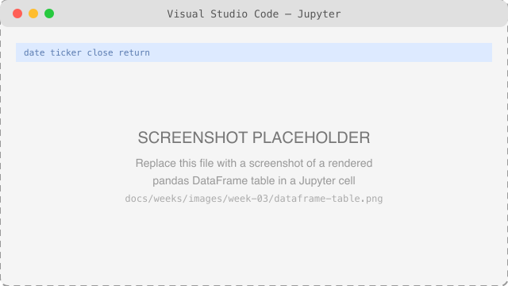
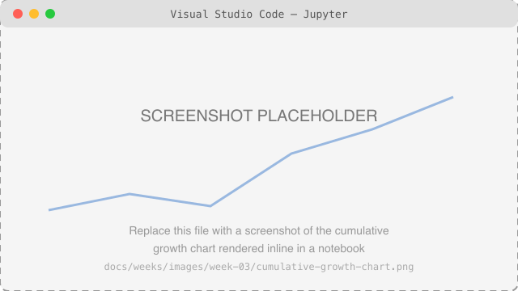

# Week 3: Python Data Analysis

**Course:** Practical AI Engineering for Finance  
**Audience:** Senior undergraduate students  
**Schedule:** 1 hour per day, 4 days per week  
**Week Theme:** pandas DataFrames, filtering and missing values, group-by and rolling calculations, and a full performance summary

---

## Week Overview

Week 2 gave you a brief first look at pandas — enough to recognize a DataFrame and compute a return with `.pct_change()`. This week goes deep: loading and inspecting real tabular data, filtering and cleaning it, and calculating the rolling averages, volatility, and cumulative growth figures that show up in almost every equity research report.

By Day 4, you'll have turned four separate calculations into tested, reusable functions in `src/ai_finance_course/analysis.py`, and combined them into a single performance summary — the analysis layer your capstone's equity research assistant will eventually generate automatically.

---

## Contents

- [Learning Objectives](#learning-objectives)
- [Weekly Schedule](#weekly-schedule)
- [Day 1: DataFrames and CSV Files](#day-1-dataframes-and-csv-files)
- [Day 2: Filtering, Sorting, and Missing Values](#day-2-filtering-sorting-and-missing-values)
- [Day 3: Group-By and Rolling Calculations](#day-3-group-by-and-rolling-calculations)
- [Day 4: Testing and the Performance Summary](#day-4-testing-and-the-performance-summary)
- [Polars: A Faster Alternative to pandas](#polars-a-faster-alternative-to-pandas)
- [Week 3 Coding Lab](#week-3-coding-lab)
- [Practice Exercises](#practice-exercises)
- [Common Mistakes](#common-mistakes)
- [Interview Preparation](#interview-preparation)
- [Week 3 Quiz](#week-3-quiz)
- [Week 3 Project Submission Checklist](#week-3-project-submission-checklist)
- [Week 3 Reflection](#week-3-reflection)
- [Key Terms](#key-terms)
- [Week Summary](#week-summary)
- [Suggested Reading](#suggested-reading)
- [Next Week](#next-week)

---

# Learning Objectives

By the end of Week 3, you should be able to:

- Load a CSV into a pandas DataFrame and inspect its shape, types, and summary statistics.
- Select rows and columns using `[]`, `.loc`, and `.iloc`.
- Filter rows, sort a DataFrame, and handle missing values.
- Group rows and compute rolling averages and rolling volatility.
- Calculate cumulative growth from a series of returns.
- Combine several calculations into one tested, reusable performance-summary function.

---

# Weekly Schedule

| Day | Topic | Main Deliverable |
|---|---|---|
| Day 1 | DataFrames and CSV files | Loaded and inspected sample prices |
| Day 2 | Filtering, sorting, and missing values | A cleaned, sorted DataFrame |
| Day 3 | Group-by and rolling calculations | Rolling average, volatility, and cumulative growth columns |
| Day 4 | Testing and communication | A tested performance-summary function |

Each class follows the same session structure as Weeks 1–2: review and setup, new concept, guided practice, testing, and committing the work.

---

# Day 1: DataFrames and CSV Files

## 1.1 What Is a DataFrame?

A pandas **DataFrame** is a table: rows and columns, each column with its own type, all sharing a common row index. Where Week 2's dictionaries held one company's fields, a DataFrame holds many rows of the same shape at once — exactly what you need for a time series of prices.

## 1.2 Loading a CSV

```python
import pandas as pd

# Same sample data used throughout this course
prices = pd.read_csv("data/sample/prices.csv")

print(prices)
```

## 1.3 Inspecting a DataFrame

```python
print(prices.head())     # first 5 rows
print(prices.dtypes)     # each column's data type
print(prices.describe()) # count, mean, std, min/max for numeric columns
print(prices.info())     # row count, column types, memory usage
```



*Screenshot to add: a Jupyter cell showing `prices.head()` rendered as pandas' HTML table (it looks noticeably nicer than a printed script's output). Replace `docs/weeks/images/week-03/dataframe-table.png` with your own screenshot.*

## 1.4 Selecting Columns and Rows

```python
print(prices["close"])          # a single column, as a Series
print(prices[["date", "close"]])  # multiple columns, as a DataFrame

print(prices.loc[0])             # row by label (the index value)
print(prices.iloc[0])            # row by position (always 0-based)
```

`.loc` selects by label; `.iloc` selects by position. With the default integer index they often look the same — the difference matters once you set a custom index (for example, the date column).

## Day 1 Activity

Load `data/sample/prices.csv` and print its shape (`prices.shape`), the column names (`prices.columns`), and the average closing price (`prices["close"].mean()`).

---

# Day 2: Filtering, Sorting, and Missing Values

## 2.1 Filtering Rows

```python
# A boolean condition, applied inside [], keeps only matching rows
above_101 = prices[prices["close"] > 101]

print(above_101)
```

## 2.2 Sorting

```python
by_price = prices.sort_values("close")                      # ascending
by_price_desc = prices.sort_values("close", ascending=False)  # descending

print(by_price_desc.head())
```

## 2.3 Missing Values

Real data is rarely complete. pandas represents a missing value as `NaN` ("not a number").

```python
import numpy as np

# Simulate a missing price, the way a real data feed sometimes has gaps
messy_prices = prices.copy()
messy_prices.loc[2, "close"] = np.nan

print(messy_prices.isna())               # True wherever a value is missing
print(messy_prices.dropna())              # drops any row with a missing value
print(messy_prices.fillna(method="ffill"))  # fills forward from the last valid price
```

Dropping rows loses data; filling forward assumes "yesterday's price" is a reasonable stand-in. Which is appropriate depends on what you're calculating — always decide deliberately rather than accepting pandas' default.

## Day 2 Activity

Using `messy_prices` from §2.3, compare the row count after `.dropna()` versus the original DataFrame, and print both.

---

# Day 3: Group-By and Rolling Calculations

## 3.1 Group-By

The sample data has only one ticker, so add a second one to see group-by do something meaningful:

```python
import pandas as pd

two_tickers = pd.concat([
    prices.assign(ticker="DEMO"),
    prices.assign(ticker="DEMO2", close=prices["close"] * 1.1),
])

# One average closing price per ticker, instead of one for the whole table
print(two_tickers.groupby("ticker")["close"].mean())
```

`.groupby()` splits the DataFrame by the given column, applies a calculation to each group separately, and combines the results back into one output.

## 3.2 Rolling Calculations

A **rolling** calculation looks at a moving window of consecutive rows — the last 3 days, for example — instead of the whole column at once.

```python
prices["return"] = prices["close"].pct_change()

# window=3: each value looks at itself and the two rows before it
prices["rolling_avg_return"] = prices["return"].rolling(window=3).mean()
prices["rolling_volatility"] = prices["return"].rolling(window=3).std()

print(prices)
```

The first two rows of each rolling column are `NaN` — there aren't yet 3 rows to compute a window over. That's expected, not a bug.

## 3.3 Cumulative Growth

```python
# (1 + returns) compounds each period's growth; cumprod() multiplies them
# together running total, e.g. [1.05, 1.05 * 0.98, ...]
prices["cumulative_growth"] = (1 + prices["return"].fillna(0)).cumprod()

print(prices[["date", "cumulative_growth"]])
```

A `cumulative_growth` of `1.08` means $1 invested at the start would be worth $1.08 as of that row.

## Day 3 Activity

Change the rolling window from 3 to 2 and re-run §3.2. Explain in one sentence why the first `NaN` row shifts.

---

# Day 4: Testing and the Performance Summary

## 4.1 Testing pandas Code

Week 2 §4.1 introduced automated testing with small, hand-built inputs instead of eyeballing printed output. The same idea applies to pandas functions — build a tiny DataFrame or Series by hand, so you know exactly what the correct answer should be:

```python
# File: tests/test_analysis.py
import pandas as pd
import pytest

from ai_finance_course.analysis import rolling_average


def test_rolling_average() -> None:
    series = pd.Series([1.0, 2.0, 3.0, 4.0])

    result = rolling_average(series, window=2)

    assert result.iloc[1] == pytest.approx(1.5)
```

## 4.2 Building the Performance Summary

[`src/ai_finance_course/analysis.py`](https://github.com/CJ5815/practical-ai-engineering-finance/blob/main/src/ai_finance_course/analysis.py) has four functions, each doing one job:

```python
def add_daily_returns(prices: pd.DataFrame, price_column: str = "close") -> pd.DataFrame:
    """Add a simple daily return column to a prices DataFrame."""
    result = prices.copy()
    result["return"] = result[price_column].pct_change()
    return result
```

`rolling_average`, `rolling_volatility`, and `cumulative_growth` follow the same shape — read them in [`src/ai_finance_course/analysis.py`](https://github.com/CJ5815/practical-ai-engineering-finance/blob/main/src/ai_finance_course/analysis.py). Wiring all four together into one performance summary is [`examples/week-03/performance_summary.py`](https://github.com/CJ5815/practical-ai-engineering-finance/blob/main/examples/week-03/performance_summary.py) (and the identical [`performance_summary.ipynb`](https://github.com/CJ5815/practical-ai-engineering-finance/blob/main/examples/week-03/performance_summary.ipynb)):

```bash
python examples/week-03/performance_summary.py
```



*Screenshot to add: the cumulative-growth line chart rendered inline after running `performance_summary.ipynb`. Replace `docs/weeks/images/week-03/cumulative-growth-chart.png` with your own screenshot.*

See Week 2's [Running as a Script vs. a Notebook](week-02_Practical_AI_Engineering_for_Finance.md#running-as-a-script-vs-a-notebook) for when to reach for each.

## Day 4 Activity

Write a short reflection: what does `cumulative_growth` measure, and why does it matter more to an investor than a single day's return?

---

# Polars: A Faster Alternative to pandas

## Why Look at Polars Now?

Week 2 gave you a one-line glimpse of polars. Now that you've spent this whole week with pandas — DataFrames, filtering, sorting, missing values, group-by, rolling calculations, and cumulative growth — you're in a good position to see how the same operations look in polars, and why some teams choose it over pandas for large datasets.

**polars** is a DataFrame library written in Rust, built from the ground up for speed and memory efficiency. It supports two execution modes:

- **Eager** (like pandas): every operation runs immediately — for example, `pl.read_csv(...)`.
- **Lazy**: you build up a *query plan* first (`pl.scan_csv(...)`), and polars optimizes and runs the whole pipeline only when you call `.collect()`. This lets polars skip work pandas can't — for example, only reading the columns you actually use.

This section only uses eager mode, to keep a direct, side-by-side comparison with the pandas code you already wrote this week.

## Rewriting This Week's Pipeline in Polars

Every operation from Days 1–3, shown in polars.

### Loading and Inspecting

```python
import polars as pl

prices = pl.read_csv("data/sample/prices.csv")

print(prices.head())
print(prices.schema)      # polars' equivalent of pandas' .dtypes
print(prices.describe())
```

### Filtering and Sorting

```python
above_101 = prices.filter(pl.col("close") > 101)

by_price_desc = prices.sort("close", descending=True)
```

### Missing Values

```python
messy_prices = pl.DataFrame({"close": [100.0, 101.25, None, 103.10, 104.00]})

print(messy_prices.null_count())                    # polars' equivalent of .isna().sum()
print(messy_prices.drop_nulls())
print(messy_prices.fill_null(strategy="forward"))
```

polars uses a real `null` type instead of pandas' float-based `NaN` — one reason a polars column keeps an integer type even when values are missing, where pandas would silently upcast it to `float64`.

### Group-By and Rolling Calculations

```python
two_tickers = pl.concat([
    prices.with_columns(ticker=pl.lit("DEMO")),
    prices.with_columns(ticker=pl.lit("DEMO2"), close=pl.col("close") * 1.1),
])

print(two_tickers.group_by("ticker").agg(pl.col("close").mean()))

prices = prices.with_columns(
    (pl.col("close") / pl.col("close").shift(1) - 1).alias("return")
)
prices = prices.with_columns(
    pl.col("return").rolling_mean(window_size=3).alias("rolling_avg_return"),
    pl.col("return").rolling_std(window_size=3).alias("rolling_volatility"),
)
```

Notice the style: pandas mutates or reassigns columns with `df["x"] = ...`; polars builds **expressions** (`pl.col("return").rolling_mean(...)`) and applies several at once inside a single `.with_columns()`.

### Cumulative Growth

```python
prices = prices.with_columns(
    (1 + pl.col("return").fill_null(0)).cum_prod().alias("cumulative_growth")
)
```

## pandas vs. Polars: At a Glance

| | pandas | polars |
|---|---|---|
| Written in | Python (with Cython/NumPy underneath) | Rust |
| API style | Method calls on a mutable DataFrame; boolean masks (`df[df["x"] > 1]`) | Expressions (`pl.col("x")`), composed inside `.filter()` / `.with_columns()` |
| Execution | Eager only | Eager (`read_csv`) or lazy (`scan_csv` + `.collect()`) |
| Missing value marker | `NaN` (a float, even in integer columns) | `null` (a real missing-value marker, any dtype) |
| Multi-core use | Limited, mostly single-threaded | Parallel by default across columns and rows |
| Typical speed on large files | Slower | Often several times faster, especially in lazy mode |
| Ecosystem maturity | Extremely mature — the default choice almost everywhere | Newer, growing fast, fewer third-party integrations |
| Best fit | Small-to-medium data; maximum tutorial/library support | Large datasets; performance-sensitive pipelines |

## When to Reach for Polars

Default to pandas while you're still learning, or whenever a library you depend on (many plotting and machine-learning tools) expects a pandas DataFrame directly. Reach for polars once your data is large enough that pandas feels slow, or when you're building a new pipeline from scratch and can choose the fastest tool without inheriting pandas-only dependencies.

---

# Week 3 Coding Lab

## Performance Summary Function

Extend [`src/ai_finance_course/analysis.py`](https://github.com/CJ5815/practical-ai-engineering-finance/blob/main/src/ai_finance_course/analysis.py) and [`tests/test_analysis.py`](https://github.com/CJ5815/practical-ai-engineering-finance/blob/main/tests/test_analysis.py):

- confirm all four functions (`add_daily_returns`, `rolling_average`, `rolling_volatility`, `cumulative_growth`) exist and are tested;
- run `python examples/week-03/performance_summary.py` and confirm it prints a complete table and shows a chart;
- run `pytest` and confirm every test passes.

### Required Features

- type hints on every function;
- a docstring on every function, following Week 2 §3.2's comment rules;
- at least one test per function, using small hand-built data (Week 3 §4.1);
- no runtime errors;
- all work committed and pushed to GitHub.

---

# Practice Exercises

## Exercise 1: Inspecting Data

Load `data/sample/prices.csv` and print the row with the highest closing price using `.sort_values()` and `.iloc[0]`.

## Exercise 2: Filtering Practice

Filter `prices` to rows where the daily return (§3.2) was negative, and print how many there are.

## Exercise 3: A Different Window

Recompute rolling volatility with a window of your choice (not 3) and explain in a comment why you picked it.

## Exercise 4: Group-By Practice

Using the two-ticker example from §3.1, find which ticker had the higher average closing price.

## Exercise 5: Git Practice

Make three commits: one for `analysis.py`, one for `test_analysis.py`, and one for `performance_summary.py`/`.ipynb`.

---

# Common Mistakes

## Forgetting `.copy()`

```python
# Wrong: mutates the caller's original DataFrame
def add_daily_returns(prices):
    prices["return"] = prices["close"].pct_change()
    return prices
```

Without `.copy()`, a function that "adds a column" silently changes the DataFrame the caller passed in — a surprising side effect. `analysis.py`'s `add_daily_returns` copies first specifically to avoid this.

## Confusing `.loc` and `.iloc`

`.loc` uses labels; `.iloc` uses position. They coincide with the default index, which is exactly what makes the mix-up easy to miss until you set a custom index.

## Expecting no `NaN` in rolling columns

The first `(window - 1)` rows of any rolling calculation are `NaN` by design (§3.2) — that's not a bug to "fix" by filling arbitrarily.

## Testing pandas code against the real CSV

Prefer small, hand-built `pd.Series`/`pd.DataFrame` inputs in tests (§4.1) — if the sample data ever changes, tests built against it would break for the wrong reason.

---

# Interview Preparation

1. What is a DataFrame, and how is it different from a Python list of dictionaries?
2. What's the difference between `.loc` and `.iloc`?
3. What does `.groupby()` do, conceptually?
4. Why does a rolling calculation produce `NaN` values at the start of a series?
5. What does "cumulative growth" mean, and how is it different from a single period's return?
6. Why might you choose `.dropna()` over `.fillna()`, or vice versa?
7. Why test a pandas function with a small hand-built DataFrame instead of your real dataset?
8. Why does `add_daily_returns` return a copy instead of modifying its input?

---

# Week 3 Quiz

## Multiple Choice

1. What does `prices.head()` show?

   A. The last 5 rows  
   B. The first 5 rows  
   C. Every row  
   D. Only column names

2. Which selects a row by position, regardless of its label?

   A. `.loc`  
   B. `.iloc`  
   C. `.groupby`  
   D. `.describe`

3. What does `.rolling(window=3).mean()` compute?

   A. The average of the whole column  
   B. The average of each group of 3 consecutive rows  
   C. The average of every third row  
   D. The maximum of 3 rows

4. Why are the first two values `NaN` in a 3-row rolling average?

   A. pandas has a bug  
   B. There aren't yet 3 rows to average  
   C. The data was missing  
   D. Rolling averages always start at 0

5. What does `cumulative_growth` represent?

   A. The return on a single day  
   B. The growth factor of $1 invested since the start of the series  
   C. The average of all returns  
   D. The standard deviation of returns

## Short Answer

6. Explain, in your own words, what `.groupby("ticker")` does to a multi-ticker DataFrame.

7. Why does `add_daily_returns` use `.copy()` before adding a column?

8. What's the difference between `.dropna()` and `.fillna()`, and when would you choose each?

9. Why build a small hand-written DataFrame for a test instead of using the real sample CSV?

10. What does a rolling volatility measure, in plain English?

---

# Week 3 Project Submission Checklist

- [ ] `analysis.py` has all four functions: `add_daily_returns`, `rolling_average`, `rolling_volatility`, `cumulative_growth`.
- [ ] Each function has a docstring and type hints.
- [ ] `tests/test_analysis.py` has at least one test per function, using small hand-built data.
- [ ] `pytest` passes with no failures.
- [ ] `examples/week-03/performance_summary.py` runs without errors and shows a chart.
- [ ] `examples/week-03/performance_summary.ipynb` runs without errors, cell by cell.
- [ ] All work is committed and pushed to GitHub.

---

# Week 3 Reflection

Write 200–300 words answering:

1. What did you build this week?
2. What's the difference between a rolling calculation and a cumulative one?
3. What error did you encounter, and how did you fix it?
4. Which pandas method (`.loc`, `.groupby`, `.rolling`, etc.) took the longest to understand? Why?
5. What would you improve?

Save as:

```text
week3_reflection.md
```

---

# Key Terms

| Term | Definition |
|---|---|
| DataFrame | A pandas table of rows and labeled columns |
| Series | A single labeled column of data |
| `.loc` | Select rows/columns by label |
| `.iloc` | Select rows/columns by position |
| Filtering | Keeping only rows that match a condition |
| Missing value (`NaN`) | A gap in the data, represented as "not a number" |
| Group-by | Splitting rows into groups and computing per-group results |
| Rolling calculation | A statistic computed over a moving window of rows |
| Volatility | The standard deviation of returns — a measure of risk |
| Cumulative growth | The compounded growth factor of $1 over a series of returns |

---

# Week Summary

During Week 3, you:

- loaded and inspected a CSV as a pandas DataFrame;
- selected rows and columns with `[]`, `.loc`, and `.iloc`;
- filtered rows, sorted a DataFrame, and handled missing values;
- grouped rows and computed rolling averages and rolling volatility;
- calculated cumulative growth from a series of returns;
- tested pandas functions with small, hand-built data;
- combined four functions into one performance-summary script and notebook.

---

# Suggested Reading

## Required

- pandas documentation, "10 minutes to pandas"
- pandas documentation, "Working with missing data"

## Recommended

- Wes McKinney, *Python for Data Analysis*
- pandas documentation, "Group by: split-apply-combine"

---

# Next Week

## Week 4: Working with APIs

Week 4 introduces:

- HTTP requests and responses;
- calling a public API from Python;
- parsing JSON into Python data structures;
- handling errors and rate limits.

You'll use these skills to pull real financial data into the capstone instead of the sample CSV.
