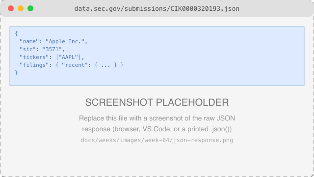
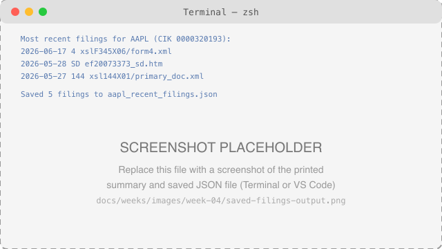

# Week 4: Working with APIs

**Course:** Practical AI Engineering for Finance  
**Audience:** Senior undergraduate students  
**Schedule:** 1 hour per day, 4 days per week  
**Week Theme:** HTTP, REST, JSON, sending requests, validating responses, and saving clean data

---

## Week Overview

Every week so far has worked with data that was already sitting in a file — `data/sample/prices.csv`. Real equity research doesn't work that way: the data lives on someone else's server, and you retrieve it over the internet using an **API** (Application Programming Interface).

This week you'll call a real, public, no-API-key-required API — the **SEC's EDGAR system** — to look up a company by ticker and retrieve its recent filings. By Day 4, you'll have a tested, reusable module that fetches, validates, and saves that data, the same "reusable function first, tested, then combined into a script" pattern from Weeks 2 and 3.

Week 5 goes deeper on making API code *reliable* — timeouts, retries, rate limits, and secrets management. This week stays intentionally introductory: send a request, read the response, validate it, save it.

---

## Contents

- [Learning Objectives](#learning-objectives)
- [Weekly Schedule](#weekly-schedule)
- [Day 1: HTTP, REST, and JSON](#day-1-http-rest-and-json)
- [Day 2: Sending a GET Request](#day-2-sending-a-get-request)
- [Day 3: Validating and Saving a Response](#day-3-validating-and-saving-a-response)
- [Day 4: Testing and Documenting an API Call](#day-4-testing-and-documenting-an-api-call)
- [Week 4 Coding Lab](#week-4-coding-lab)
- [Practice Exercises](#practice-exercises)
- [Common Mistakes](#common-mistakes)
- [Interview Preparation](#interview-preparation)
- [Week 4 Quiz](#week-4-quiz)
- [Week 4 Project Submission Checklist](#week-4-project-submission-checklist)
- [Week 4 Reflection](#week-4-reflection)
- [Key Terms](#key-terms)
- [Week Summary](#week-summary)
- [Suggested Reading](#suggested-reading)
- [Next Week](#next-week)

---

# Learning Objectives

By the end of Week 4, you should be able to:

- Explain what an API is, and how a request/response cycle works.
- Read an HTTP status code and know what it means.
- Convert between JSON and Python's built-in data types.
- Send a GET request with `httpx` and inspect the response.
- Validate an API response with a pydantic model before trusting it.
- Save a clean subset of API data as JSON.
- Test API-handling code without making real network calls in the test itself.

---

# Weekly Schedule

| Day | Topic | Main Deliverable |
|---|---|---|
| Day 1 | HTTP, REST, and JSON concepts | Notes on status codes and JSON types |
| Day 2 | Sending a GET request | A working request against a real API |
| Day 3 | Validating and saving a response | A pydantic-validated, saved JSON file |
| Day 4 | Testing and documenting an API call | Tested `edgar.py` module |

Each class follows the same session structure as Weeks 1–3: review and setup, new concept, guided practice, testing, and committing the work.

---

# Day 1: HTTP, REST, and JSON

## 1.1 What Is an API?

An **API** is how one program asks another program for data or action, over a defined interface — usually, for web APIs, over HTTP.

```text
Your Python code                          SEC's server
   (client)                               (data.sec.gov)
      |                                          |
      |  1. HTTP request  ------------------->   |
      |     GET /submissions/CIK0000320193.json   |
      |                                          |
      |   <----------------------  2. HTTP response
      |        status code + JSON body            |
```

A **REST API** (the style almost all modern web APIs follow) organizes data as resources, each with its own URL — `/submissions/CIK0000320193.json` is "the submissions resource for CIK 0000320193."

## 1.2 HTTP Methods and Status Codes

| Method | Purpose |
|---|---|
| `GET` | Retrieve data, without changing anything on the server |
| `POST` | Create something new |
| `PUT` | Replace something that exists |
| `DELETE` | Remove something |

This week only uses `GET` — you're reading public filings, not creating or changing anything.

| Status Code | Meaning |
|---|---|
| `200 OK` | The request succeeded |
| `400 Bad Request` | Your request was malformed |
| `401 Unauthorized` | Missing or invalid credentials |
| `403 Forbidden` | You don't have permission for this resource |
| `404 Not Found` | The resource doesn't exist |
| `429 Too Many Requests` | You've been rate-limited — slow down |
| `500 Internal Server Error` | Something broke on the server, not your request |

You can see a real `404` yourself:

```bash
curl -H "User-Agent: Your Name your.email@example.com" \
  https://data.sec.gov/submissions/CIK0000000000.json
```

`CIK0000000000` isn't a real company, so SEC's server correctly responds `404 Not Found`.

## 1.3 What Is JSON?

**JSON** (JavaScript Object Notation) is the most common format APIs use to send structured data. It maps directly onto Python's built-in types:

| JSON | Python |
|---|---|
| `{ "key": "value" }` (object) | `dict` |
| `[1, 2, 3]` (array) | `list` |
| `"text"` (string) | `str` |
| `42` / `3.14` (number) | `int` / `float` |
| `true` / `false` | `True` / `False` |
| `null` | `None` |

Python's `json` module (and `httpx`'s `.json()` method, used starting Day 2) converts between the two automatically.

## 1.4 The SEC EDGAR API

This course uses the **SEC's EDGAR API** (`data.sec.gov` and `www.sec.gov`) — free, no API key, real data, and directly relevant to the equity-research capstone. SEC's only requirement is a descriptive `User-Agent` header identifying who's calling, e.g. `"Your Name your.email@example.com"` — without one, requests are often rejected. That's what the `SEC_USER_AGENT` variable in `.env.example` is for; Week 5 covers environment variables and secrets in depth, but you'll use one starting Day 2 this week.

See the [official EDGAR API documentation](https://www.sec.gov/search-filings/edgar-application-programming-interfaces) for the full set of available endpoints.

## Day 1 Activity

Using `curl` (or a browser), fetch `https://data.sec.gov/submissions/CIK0000320193.json` with a `User-Agent` header identifying yourself, and note: what's the HTTP status code, and what are the top-level keys in the JSON response?

---

# Day 2: Sending a GET Request

## 2.1 A Minimal GET Request

```python
import httpx

headers = {"User-Agent": "Your Name your.email@example.com"}
response = httpx.get("https://www.sec.gov/files/company_tickers.json", headers=headers)

print(response.status_code)   # 200
```

## 2.2 Inspecting the Response

```python
print(response.status_code)          # the HTTP status code, as an int
print(response.headers["content-type"])  # metadata about the response itself
print(response.json())               # the body, parsed from JSON into a dict
```

`response.json()` is where JSON (§1.3) becomes Python data you can actually work with — a `dict` of `dict`s, in this case, one entry per company.



*Screenshot to add: the raw JSON response, viewed in a browser, VS Code, or printed from `response.json()`. Replace `docs/weeks/images/week-04/json-response.png` with your own screenshot.*

## 2.3 Handling a Bad Request

```python
response = httpx.get(
    "https://data.sec.gov/submissions/CIK0000000000.json",
    headers=headers,
)

print(response.status_code)   # 404

response.raise_for_status()   # raises httpx.HTTPStatusError, since 404 isn't success
```

`raise_for_status()` turns a bad status code (§1.2) into a Python exception immediately, instead of letting broken data quietly flow further into your program.

## Day 2 Activity

Send a GET request to `https://www.sec.gov/files/company_tickers.json` with your own `User-Agent`, and print how many companies are in the response (`len(response.json())`).

---

# Day 3: Validating and Saving a Response

## 3.1 Why Validate Before Using Data

An API's response is just text until you decide to trust its shape. Fields can be renamed, removed, or arrive as the wrong type — code that assumes a key always exists will crash somewhere far from where the actual problem is.

## 3.2 A pydantic Model for the Response

```python
from pydantic import BaseModel


class FilingRecord(BaseModel):
    """One filing from a company's SEC submission history."""

    form: str
    filing_date: str
    primary_document: str
    accession_number: str
```

```python
filing = FilingRecord(
    form="10-K",
    filing_date="2026-01-02",
    primary_document="10k.htm",
    accession_number="0001-26-000001",
)
```

If a required field is missing or the wrong type, pydantic raises a clear error immediately — right where the bad data entered your program, not somewhere downstream.

## 3.3 Saving Clean Output

```python
import json

with open("filings.json", "w", encoding="utf-8") as f:
    json.dump([filing.model_dump() for filing in filings], f, indent=2)
```

You could just as easily save the same data as CSV, reusing pandas from Week 3:

```python
import pandas as pd

pd.DataFrame([filing.model_dump() for filing in filings]).to_csv("filings.csv", index=False)
```

## Day 3 Activity

Create one more `FilingRecord` by hand with values you make up, and save a list containing it to a JSON file. Open the file and confirm it looks the way you expect.

---

# Day 4: Testing and Documenting an API Call

## 4.1 Testing API Code Without Hitting the Network

Tests that make real network calls are slow, flaky (the network can fail for reasons that have nothing to do with your code), and can hit rate limits (§1.2's `429`). The fix, following Week 3 §4.1's approach: split network calls from the pure logic, and only test the pure part.

```python
# File: tests/test_edgar.py
from ai_finance_course.edgar import find_cik


def test_find_cik() -> None:
    company_tickers = {
        "0": {"cik_str": 320193, "ticker": "AAPL", "title": "Apple Inc."},
    }

    assert find_cik("aapl", company_tickers) == "0000320193"
```

This test never touches the network — `company_tickers` is a small, hand-built dict, the same shape a real response would have, just without the real HTTP call.

## 4.2 Documenting an API Call

A README (or code comment) for anything that calls an external API should record: the endpoint, the required headers, and a sample of the response shape — so the next reader (including future you) doesn't have to make a live call just to understand what the code expects.

```markdown
## API Calls

**Endpoint:** `GET https://data.sec.gov/submissions/CIK{cik}.json`
**Headers:** `User-Agent: <name> <email>` (required by SEC)
**Sample shape:** `{ "name": ..., "filings": { "recent": { "form": [...], "filingDate": [...] } } }`
```



*Screenshot to add: the printed summary and saved JSON file after running `fetch_company_filings.py`. Replace `docs/weeks/images/week-04/saved-filings-output.png` with your own screenshot.*

Putting the whole week together:

```text
find_cik()          fetch_submissions()      extract_recent_filings()      save_filings_json()
 (pure, tested)  -->   (network call)     -->   (pure, tested)         -->    (file I/O)
```

## Day 4 Activity

Write a short reflection: why is `find_cik` easy to test but `fetch_submissions` isn't (without a mocking library)?

---

# Week 4 Coding Lab

## Company Filings Fetcher

Extend [`src/ai_finance_course/edgar.py`](https://github.com/CJ5815/practical-ai-engineering-finance/blob/main/src/ai_finance_course/edgar.py) and [`tests/test_edgar.py`](https://github.com/CJ5815/practical-ai-engineering-finance/blob/main/tests/test_edgar.py):

- confirm `find_cik`, `extract_recent_filings`, and `save_filings_json` all exist and are tested;
- set `SEC_USER_AGENT` in your own `.env` file (see `.env.example` — never commit the real `.env`, per Week 1 §4.7);
- run [`examples/week-04/fetch_company_filings.py`](https://github.com/CJ5815/practical-ai-engineering-finance/blob/main/examples/week-04/fetch_company_filings.py) and confirm it prints and saves real filings for `AAPL`;
- run `pytest` and confirm every test passes.

### Required Features

- type hints and a docstring on every function, following Week 2 §3.2's comment rules;
- network calls and pure logic kept in separate functions (§4.1);
- at least one test per pure function, using small hand-built data;
- no API keys, tokens, or `.env` files committed;
- all work committed and pushed to GitHub.

---

# Practice Exercises

## Exercise 1: A Different Company

Change `TICKER` in `fetch_company_filings.py` to a company of your choice and re-run it. Confirm the saved JSON reflects the new company.

## Exercise 2: Counting Filing Types

Using the filings your script fetched, count how many are `10-K` versus `10-Q` versus other form types.

## Exercise 3: Status Code Practice

Deliberately request a CIK that doesn't exist (as in §1.2) and write a small `try`/`except httpx.HTTPStatusError` block that prints a friendly message instead of a raw traceback.

## Exercise 4: CSV Output

Modify `save_filings_json` — or write a new `save_filings_csv` — that saves the same data as a CSV instead, using pandas (§3.3).

## Exercise 5: Git Practice

Make three commits: one for `edgar.py`, one for `test_edgar.py`, and one for `fetch_company_filings.py`/`.ipynb`.

---

# Common Mistakes

## Forgetting the `User-Agent` header

SEC's servers reject or rate-limit requests without a descriptive `User-Agent` (§1.4). Always set one, even for quick exploratory requests.

## Not checking the status code

```python
# Wrong: assumes the request succeeded
data = httpx.get(url, headers=headers).json()
```

A failed request often still returns a JSON body (an error message) — parsing it as if it succeeded produces confusing errors far from the real problem. Call `.raise_for_status()` first (§2.3).

## Assuming API fields never change

Validating with pydantic (§3.2) turns a silent wrong-shape bug into an immediate, clear error.

## Testing against the live network

Slow, flaky, and can trigger rate limits (`429`). Test the pure functions instead (§4.1).

## Committing `.env`

`.env` is already in `.gitignore` (Week 1 §4.7) — keep it that way. Commit `.env.example` (with placeholder values) instead.

---

# Interview Preparation

1. What is an API, in your own words?
2. What's the difference between a `404` and a `500` status code?
3. Why does JSON map so cleanly onto Python's `dict`/`list`/`str`/etc.?
4. Why does the SEC EDGAR API require a `User-Agent` header?
5. What does `response.raise_for_status()` do, and when would you call it?
6. Why validate an API response with something like pydantic instead of just using the raw dict?
7. Why is it hard to unit-test a function that makes a real network call?
8. What's the difference between saving data as JSON versus CSV, and when would you pick one over the other?

---

# Week 4 Quiz

## Multiple Choice

1. Which HTTP method retrieves data without changing anything on the server?

   A. `POST`  
   B. `GET`  
   C. `DELETE`  
   D. `PUT`

2. What does a `404` status code mean?

   A. The server crashed  
   B. You're not authorized  
   C. The resource doesn't exist  
   D. The request succeeded

3. What does `response.json()` return?

   A. A string  
   B. Python data (typically a dict or list) parsed from the response body  
   C. The HTTP status code  
   D. The request headers

4. Why does `tests/test_edgar.py` not make real network calls?

   A. pytest doesn't allow network access  
   B. Testing pure functions with hand-built data is faster and more reliable  
   C. SEC blocks all automated testing  
   D. Network calls can't return JSON

5. What is the purpose of a pydantic `BaseModel` in this context?

   A. To send the HTTP request  
   B. To validate that API data has the expected fields and types  
   C. To format printed output  
   D. To cache API responses

## Short Answer

6. Explain what happens, step by step, when you call `httpx.get(url)`.

7. Why does SEC EDGAR require a `User-Agent` header, and what should it contain?

8. What's the difference between `find_cik` and `fetch_submissions` in `edgar.py`, and why does that split matter for testing?

9. What does `raise_for_status()` do, and what would happen if you skipped it?

10. Name one thing that could go wrong with a real API response that pydantic validation would catch.

---

# Week 4 Project Submission Checklist

- [ ] `edgar.py` has `find_cik`, `fetch_submissions`, `extract_recent_filings`, and `save_filings_json`.
- [ ] Each function has a docstring and type hints.
- [ ] `tests/test_edgar.py` tests the pure functions with hand-built data — no real network calls in tests.
- [ ] `pytest` passes with no failures.
- [ ] `SEC_USER_AGENT` is set in your own `.env` (not committed).
- [ ] `examples/week-04/fetch_company_filings.py` runs and saves real filing data.
- [ ] `examples/week-04/fetch_company_filings.ipynb` runs without errors, cell by cell.
- [ ] All work is committed and pushed to GitHub.

---

# Week 4 Reflection

Write 200–300 words answering:

1. What did you build this week?
2. What's the difference between an HTTP status code and the JSON body of a response?
3. What error did you encounter, and how did you fix it?
4. Why does validating API data matter, even for a "free," well-documented API like SEC EDGAR?
5. What would you improve?

Save as:

```text
week4_reflection.md
```

---

# Key Terms

| Term | Definition |
|---|---|
| API | An interface one program uses to request data or action from another |
| REST | An API style organizing data as resources, each with its own URL |
| HTTP method | The verb of a request — `GET`, `POST`, `PUT`, `DELETE` |
| Status code | A three-digit number summarizing what happened to a request |
| JSON | A text format for structured data, mapping to Python's built-in types |
| `User-Agent` | A request header identifying who (or what) is making the call |
| Validation | Confirming data matches an expected shape before trusting it |
| pydantic | A library for defining and validating data models |
| CIK | The SEC's unique numeric identifier for a company |

---

# Week Summary

During Week 4, you:

- learned what an API is, and how the request/response cycle works;
- read HTTP status codes and understood what each means;
- converted between JSON and Python's built-in types;
- sent a real GET request with `httpx` to the SEC EDGAR API;
- validated API data with a pydantic model;
- saved a clean subset of real filing data as JSON;
- tested API-handling code without making real network calls in the test itself.

---

# Suggested Reading

## Required

- [SEC EDGAR API documentation](https://www.sec.gov/search-filings/edgar-application-programming-interfaces)
- MDN Web Docs, "HTTP response status codes"
- httpx documentation, "Quickstart"

## Recommended

- pydantic documentation, "Models"
- REST API Tutorial, restapitutorial.com

---

# Next Week

## Week 5: Reliable API Clients

Week 5 introduces:

- environment variables and secrets management;
- timeouts and exception handling;
- retries and rate limits;
- refactoring a script into a reusable API client class.

You'll turn this week's straightforward script into API code that handles the messy realities of calling a real service repeatedly and reliably.
