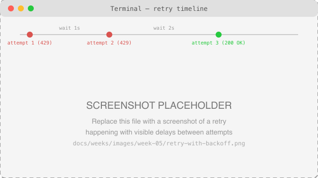
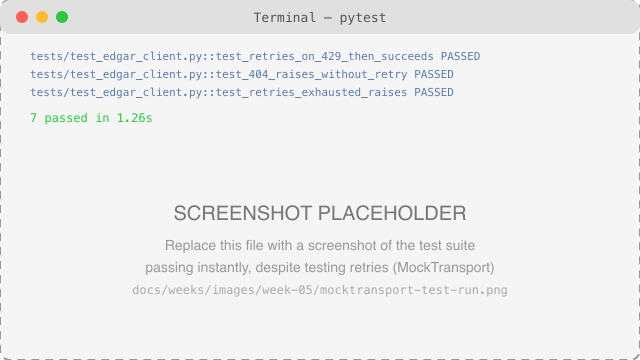

# Week 5: Reliable API Clients

**Course:** Practical AI Engineering for Finance  
**Audience:** Senior undergraduate students  
**Schedule:** 1 hour per day, 4 days per week  
**Week Theme:** Configuration and secrets, timeouts and exceptions, retries and pagination, and refactoring into a reusable client class

---

## Week Overview

Week 4 built `src/ai_finance_course/edgar.py` as a handful of functions: pass in an `httpx.Client`, get back parsed, validated data. That's fine for a guided example — but real API code has to survive things the happy path never shows you: a slow network, a `429` rate limit, a server having a bad day, thousands of filings that don't fit in one response.

This week doesn't throw away Week 4's code — it wraps it. By Day 4, the same `find_cik` and `extract_recent_filings` you already tested are called from inside a new `EdgarClient` class that owns its own configuration, retries transient failures with backoff, turns raw errors into clear ones, and pages through data too large for one response.

---

## Contents

- [Learning Objectives](#learning-objectives)
- [Weekly Schedule](#weekly-schedule)
- [Day 1: Configuration and Secrets](#day-1-configuration-and-secrets)
- [Day 2: Timeouts and Exceptions](#day-2-timeouts-and-exceptions)
- [Day 3: Retries, Rate Limits, and Pagination](#day-3-retries-rate-limits-and-pagination)
- [Day 4: Refactoring into an API Client Class](#day-4-refactoring-into-an-api-client-class)
- [Week 5 Coding Lab](#week-5-coding-lab)
- [Practice Exercises](#practice-exercises)
- [Common Mistakes](#common-mistakes)
- [Interview Preparation](#interview-preparation)
- [Week 5 Quiz](#week-5-quiz)
- [Week 5 Project Submission Checklist](#week-5-project-submission-checklist)
- [Week 5 Reflection](#week-5-reflection)
- [Key Terms](#key-terms)
- [Week Summary](#week-summary)
- [Suggested Reading](#suggested-reading)
- [Next Week](#next-week)

---

# Learning Objectives

By the end of Week 5, you should be able to:

- Explain why configuration and secrets belong outside your code, and load them safely.
- Set a timeout on an HTTP request and handle the exceptions that follow.
- Explain what a rate limit is and implement a retry with backoff.
- Retrieve data that spans multiple pages instead of one response.
- Refactor a set of related functions into a class that owns shared configuration and state.
- Test retry and error-handling logic without a mocking library or the real network.

---

# Weekly Schedule

| Day | Topic | Main Deliverable |
|---|---|---|
| Day 1 | Configuration and secrets | `.env`-based configuration, no hard-coded values |
| Day 2 | Timeouts and exceptions | Requests that fail clearly instead of hanging |
| Day 3 | Retries, rate limits, and pagination | A retry-with-backoff loop and paginated fetch |
| Day 4 | Refactoring into a client class | Tested `EdgarClient` class |

Each class follows the same session structure as Weeks 1–4: review and setup, new concept, guided practice, testing, and committing the work.

---

# Day 1: Configuration and Secrets

## 1.1 Why Configuration Belongs Outside Code

Week 4 already used one piece of configuration — `SEC_USER_AGENT` — loaded from `.env` instead of hard-coded. This week makes that pattern explicit: anything that changes between environments (a different API key, a longer timeout for a slow connection, more retries in production than in a quick local test) belongs in configuration, not buried inside a function.

## 1.2 Environment Variables and `python-dotenv`

```bash
# .env  (never committed — see .gitignore, Week 1 §4.7)
SEC_USER_AGENT=Your Name your.email@example.com
```

```python
import os

from dotenv import load_dotenv

load_dotenv()                       # reads .env into the process's environment
user_agent = os.environ["SEC_USER_AGENT"]   # raises KeyError if it's missing
```

Using `os.environ[...]` (not `.get(...)`) is deliberate: if the variable is missing, you want a loud, immediate error — not a client silently running with `None` as its `User-Agent`.

## 1.3 Never Commit Secrets

`.env` is already in `.gitignore` (Week 1 §4.7). `.env.example` is committed instead, with placeholder values, so anyone cloning the repository knows what configuration to provide without ever seeing a real secret:

```text
LLM_API_KEY=replace_me
LLM_MODEL=replace_me
SEC_USER_AGENT=Student Name student@example.com
```

This project doesn't need a real API key for SEC EDGAR — but Week 6 onward will, for an LLM provider, and the same pattern applies without any changes.

## Day 1 Activity

Confirm your own `.env` has `SEC_USER_AGENT` set (copy it from `.env.example` if not), then run `git status` and confirm `.env` does **not** appear as a tracked or staged file.

---

# Day 2: Timeouts and Exceptions

## 2.1 Why Timeouts Matter

Without a timeout, a request waits indefinitely if the server never responds — one slow or hung connection can freeze your entire program. `EdgarClient` (§4.2) sets a default `timeout=10.0`, but you can see the effect directly:

```python
import httpx

# A deliberately tiny timeout, just to trigger the exception
response = httpx.get(
    "https://data.sec.gov/submissions/CIK0000320193.json",
    headers={"User-Agent": "Your Name your.email@example.com"},
    timeout=0.001,
)
```

## 2.2 httpx's Exception Types

| Exception | When It's Raised |
|---|---|
| `httpx.TimeoutException` | The server didn't respond within the timeout |
| `httpx.HTTPStatusError` | Raised by `.raise_for_status()` on a 4xx/5xx response |
| `httpx.RequestError` | A connection-level failure (DNS, refused connection, etc.) |

```python
import httpx

try:
    response = httpx.get(url, headers=headers, timeout=0.001)
except httpx.TimeoutException:
    print("The request timed out")
except httpx.RequestError as exc:
    print(f"Connection failed: {exc}")
```

## 2.3 Turning Raw Exceptions into Clear Errors

A caller of `EdgarClient` shouldn't need to know the difference between `httpx.TimeoutException` and a `429` — both mean "this call didn't succeed." `edgar.py` defines one exception for all of them:

```python
class EdgarAPIError(Exception):
    """Raised when SEC EDGAR returns an error response, or retries are exhausted."""
```

`EdgarClient._request_with_retries` (§4.2) catches every httpx-level exception and every failed status code, and raises `EdgarAPIError` with a message that says exactly what happened — instead of a caller having to catch three different httpx exception types themselves.

## Day 2 Activity

Run the tiny-timeout example from §2.1 yourself (wrap it in a `try`/`except httpx.TimeoutException`) and print a message confirming you caught it.

---

# Day 3: Retries, Rate Limits, and Pagination

## 3.1 What Is a Rate Limit?

A **rate limit** caps how many requests you can make in a given time. Exceeding it gets you a `429 Too Many Requests` response (§1.2, Week 4) — often with a `Retry-After` header telling you exactly how long to wait.

## 3.2 Retrying with Backoff

```text
attempt 1 (429) --wait 1s--> attempt 2 (429) --wait 2s--> attempt 3 (200 OK)
```



*Screenshot to add: a retry happening with visible delays between attempts. Replace `docs/weeks/images/week-05/retry-with-backoff.png` with your own screenshot.*

Each retry waits longer than the last — "exponential backoff" — so a struggling server gets progressively more breathing room instead of being hit with an identical retry every second:

```python
import time

for attempt in range(max_retries + 1):
    response = client.get(url)
    if response.status_code < 400:
        break
    time.sleep(backoff_seconds * (2 ** attempt))   # 1s, 2s, 4s, ...
```

## 3.3 Deciding What to Retry

| Status Code | Retry? | Why |
|---|---|---|
| `429 Too Many Requests` | Yes | Transient — the server is asking you to slow down, not rejecting the request |
| `500`–`599` (server errors) | Yes | Often transient — the server may recover on the next attempt |
| `404 Not Found` | No | The resource doesn't exist; retrying changes nothing |
| Other `4xx` | No | Your request itself was the problem; retrying sends the same bad request again |

`EdgarClient._request_with_retries` (§4.2) follows exactly this table.

## 3.4 Pagination

SEC EDGAR's `filings.recent` covers only roughly the most recent 1,000 filings. Older history lives in separate files, listed under `submissions["filings"]["files"]`:

```python
submissions = client.get(url).json()
print(submissions["filings"]["files"])
# [{"name": "CIK0000320193-submissions-001.json", "filingFrom": "1994-01-26", ...}]
```

Each entry's `"name"` is itself a JSON file at the same `data.sec.gov/submissions/` path, in the same columnar shape as `filings.recent` — just without the outer `"filings"` wrapper. `EdgarClient.get_older_filings` (§4.2) fetches one page of that list at a time, rather than assuming everything fits in a single response.

## Day 3 Activity

Using `get_older_filings` (once you've built it in §4.2), fetch page `0` of a company's older filings and compare the earliest filing date there to the earliest one in `get_recent_filings`.

---

# Day 4: Refactoring into an API Client Class

## 4.1 From Functions to a Class

Week 4's functions each took an `httpx.Client` as a parameter — fine for one call, awkward once you need shared configuration (User-Agent, timeout, retry count) and a single reused connection across many calls. A **class** owns that configuration once, in `__init__`, instead of every caller re-passing it:

```python
with EdgarClient(user_agent="Your Name your.email@example.com") as client:
    filings = client.get_filings_for_ticker("AAPL")
```

One line of setup, instead of building an `httpx.Client`, threading it through four function calls, and remembering to close it.

## 4.2 The `EdgarClient` Class

```python
class EdgarClient:
    """A configured, reusable client for the SEC EDGAR API."""

    def __init__(
        self,
        user_agent: str,
        timeout: float = 10.0,
        max_retries: int = 3,
        backoff_seconds: float = 1.0,
        transport: httpx.BaseTransport | None = None,
    ) -> None:
        self.max_retries = max_retries
        self.backoff_seconds = backoff_seconds
        self._client = httpx.Client(
            headers={"User-Agent": user_agent},
            timeout=timeout,
            transport=transport,   # only set in tests — see §4.3
        )

    def __enter__(self) -> "EdgarClient":
        return self

    def __exit__(self, *exc_info: object) -> None:
        self._client.close()
```

`__enter__`/`__exit__` make `EdgarClient` work with `with`, guaranteeing the underlying connection closes even if an error happens partway through. The retry logic lives in one private method, `_request_with_retries`, that every public method (`find_cik`, `get_recent_filings`, `get_older_filings`, `get_filings_for_ticker`) calls — implementing §3.2's backoff loop and §3.3's retry table in exactly one place. Read the full implementation in [`src/ai_finance_course/edgar.py`](https://github.com/CJ5815/practical-ai-engineering-finance/blob/main/src/ai_finance_course/edgar.py).

## 4.3 Testing with `httpx.MockTransport`

Week 4 §4.1 tested only pure functions, skipping network calls entirely. That doesn't work this week — retries, timeouts, and backoff *are* the behavior being tested. `httpx.MockTransport` (built into httpx, no new dependency) solves this: it replaces the real network with a plain Python function you control.

```python
import httpx

from ai_finance_course.edgar import EdgarClient


def test_retries_on_429_then_succeeds() -> None:
    calls = {"count": 0}

    def handler(request: httpx.Request) -> httpx.Response:
        calls["count"] += 1
        if calls["count"] == 1:
            return httpx.Response(429, headers={"Retry-After": "0"})
        return httpx.Response(200, json={"filings": {"recent": {...}}})

    transport = httpx.MockTransport(handler)
    with EdgarClient(user_agent="Test", transport=transport, backoff_seconds=0.01) as client:
        client.get_recent_filings("0000320193")

    assert calls["count"] == 2
```



*Screenshot to add: `pytest` output showing the retry tests passing in a fraction of a second. Replace `docs/weeks/images/week-05/mocktransport-test-run.png` with your own screenshot.*

`backoff_seconds=0.01` is what keeps this instant instead of actually waiting seconds per retry — the test still exercises the real retry loop, just with delays too short to notice.

## Day 4 Activity

Write a short reflection: why did Week 4's testing approach (pure functions only) stop being enough this week?

---

# Week 5 Coding Lab

## Reliable Filings Client

Extend [`src/ai_finance_course/edgar.py`](https://github.com/CJ5815/practical-ai-engineering-finance/blob/main/src/ai_finance_course/edgar.py) and [`tests/test_edgar_client.py`](https://github.com/CJ5815/practical-ai-engineering-finance/blob/main/tests/test_edgar_client.py):

- confirm `EdgarClient` retries `429`/`5xx`, does not retry `404`, and raises `EdgarAPIError` with a clear message in both the "exhausted" and "non-retryable" cases;
- confirm `get_older_filings` returns `[]` for an out-of-range page instead of raising;
- run [`examples/week-05/reliable_fetch.py`](https://github.com/CJ5815/practical-ai-engineering-finance/blob/main/examples/week-05/reliable_fetch.py) and confirm it produces the same real results as Week 4's script;
- run `pytest` and confirm every test passes, quickly (§4.3).

### Required Features

- type hints and a docstring on every method, following Week 2 §3.2's comment rules;
- retry logic lives in exactly one place, not duplicated per method;
- tests use `httpx.MockTransport`, not the real network, and use small `backoff_seconds` so they stay fast;
- no API keys, tokens, or `.env` files committed;
- all work committed and pushed to GitHub.

---

# Practice Exercises

## Exercise 1: A Custom Timeout

Construct an `EdgarClient` with `timeout=0.001` and confirm it raises (wrap the call and catch the resulting `EdgarAPIError`).

## Exercise 2: Counting Retries

Using `httpx.MockTransport`, write a test where the handler always returns `500`, and assert `EdgarClient` gives up after exactly `max_retries + 1` attempts.

## Exercise 3: A Second Page

Extend `get_older_filings` usage to fetch pages `0` and `1` (if the company has both) and combine the results into one list.

## Exercise 4: Respecting `Retry-After`

Write a test where the mock handler returns `429` with `Retry-After: 2`, and confirm (by patching or inspecting timing) that the client waits that long rather than using the default backoff.

## Exercise 5: Git Practice

Make three commits: one for the `EdgarClient` class, one for `test_edgar_client.py`, and one for `reliable_fetch.py`/`.ipynb`.

---

# Common Mistakes

## Retrying everything, including `404`

Wastes time and can look like a hang. Only retry what §3.3's table says is worth retrying.

## Hard-coding a timeout or User-Agent inline

```python
# Wrong: buried inside a function, not configuration
response = httpx.get(url, headers={"User-Agent": "hello"}, timeout=30)
```

Configuration values belong in `.env` (§1.2) or as constructor parameters (§4.2), not string literals scattered through the code.

## Testing retries against the real network

Slow, and you can't reliably force a `429` or a timeout from a real server on demand. Use `httpx.MockTransport` (§4.3) instead.

## Forgetting to close the client

Without `with EdgarClient(...) as client:`, the underlying connection may not close properly. Always use the context manager.

## Assuming one response has everything

`filings.recent` looks complete until a company has more filings than it holds. Check `filings.files` (§3.4) before assuming you have the full history.

---

# Interview Preparation

1. Why should configuration and secrets live outside your code?
2. What's the difference between `httpx.TimeoutException` and `httpx.HTTPStatusError`?
3. Why retry a `429` or `500` but not a `404`?
4. What does exponential backoff mean, and why not just retry immediately?
5. What is `httpx.MockTransport`, and why does it make retry logic testable?
6. Why does an API client benefit from being a class instead of a set of functions, once retries and configuration are involved?
7. What does a `Retry-After` header tell you, and how should a client use it?
8. What does pagination solve, and how did you find SEC EDGAR's pagination mechanism?

---

# Week 5 Quiz

## Multiple Choice

1. Where should an API key or User-Agent string live?

   A. Hard-coded in the function that uses it  
   B. In a `.env` file, loaded at runtime  
   C. In a comment above the function  
   D. In the test file

2. Which status code means "you've been rate-limited"?

   A. `404`  
   B. `500`  
   C. `429`  
   D. `403`

3. Why does exponential backoff increase the wait time on each retry?

   A. To make the code more complicated  
   B. To give a struggling server progressively more time to recover  
   C. Because httpx requires it  
   D. To use up the maximum retry count faster

4. What does `httpx.MockTransport` let you do?

   A. Send real requests faster  
   B. Replace the real network with a function you control, for testing  
   C. Automatically retry failed requests  
   D. Cache API responses to disk

5. Why does `EdgarClient` retry a `500` but not a `404`?

   A. `500` is always caused by bad input  
   B. `404` means the resource doesn't exist, so retrying can't help; `500` may be transient  
   C. `404` is more common than `500`  
   D. There's no difference; both should be retried

## Short Answer

6. Explain, in your own words, why a class is a better fit than loose functions once a client has configuration and retry state.

7. What's the difference between the `transport` parameter (used in tests) and a normal `EdgarClient` in production?

8. Why does `_request_with_retries` exist in exactly one place, rather than being duplicated per method?

9. What happens if you forget to set `SEC_USER_AGENT` in your `.env`, given how `os.environ[...]` is used (§1.2)?

10. Why is pagination necessary for a company like Apple with decades of filing history?

---

# Week 5 Project Submission Checklist

- [ ] `EdgarClient` has `find_cik`, `get_recent_filings`, `get_older_filings`, and `get_filings_for_ticker`.
- [ ] Retries follow §3.3's table (`429`/`5xx` retried, other `4xx` raised immediately).
- [ ] `EdgarAPIError` is raised with a clear message in both failure cases.
- [ ] `tests/test_edgar_client.py` uses `httpx.MockTransport`, not the real network, and runs fast.
- [ ] `pytest` passes with no failures.
- [ ] `SEC_USER_AGENT` is set in your own `.env` (not committed).
- [ ] `examples/week-05/reliable_fetch.py` runs and produces real filing data.
- [ ] `examples/week-05/reliable_fetch.ipynb` runs without errors, cell by cell.
- [ ] All work is committed and pushed to GitHub.

---

# Week 5 Reflection

Write 200–300 words answering:

1. What did you build this week?
2. What's the difference between retrying a request and handling an error?
3. What error did you encounter, and how did you fix it?
4. Why does testing retry logic need `httpx.MockTransport` instead of the pure-function approach from Week 4?
5. What would you improve?

Save as:

```text
week5_reflection.md
```

---

# Key Terms

| Term | Definition |
|---|---|
| Configuration | Values that change between environments, kept outside the code itself |
| Secret | A credential (API key, token) that must never be committed |
| Timeout | The maximum time to wait for a response before giving up |
| Rate limit | A cap on how many requests you can make in a given time |
| Retry with backoff | Retrying a failed request with increasing delay between attempts |
| Pagination | Splitting a large result across multiple requests/pages |
| `httpx.MockTransport` | A test tool that replaces the real network with a function you control |
| Client class | An object that owns shared configuration and connection state across many calls |

---

# Week Summary

During Week 5, you:

- moved configuration and secrets into `.env`, loaded safely at runtime;
- set timeouts and handled httpx's exception types;
- built a retry-with-backoff loop, and learned which status codes are worth retrying;
- paginated through a company's older SEC filings;
- refactored Week 4's loose functions into a configured, reusable `EdgarClient` class;
- tested retry and error-handling logic with `httpx.MockTransport`, without a mocking library or the real network.

---

# Suggested Reading

## Required

- httpx documentation, "Timeouts"
- httpx documentation, "Exceptions"
- httpx documentation, "MockTransport"

## Recommended

- [SEC EDGAR API documentation](https://www.sec.gov/search-filings/edgar-application-programming-interfaces)
- Stripe API documentation, "Error handling" (a well-known example of clear API error design)

---

# Next Week

## Week 6: Prompt Engineering

Week 6 introduces:

- writing prompts that specify role, task, evidence, and constraints;
- controlling output format;
- building reusable prompt templates.

You'll create three prompt templates — earnings summary, risk extraction, and company comparison — the first step toward the capstone's LLM-powered analysis.
